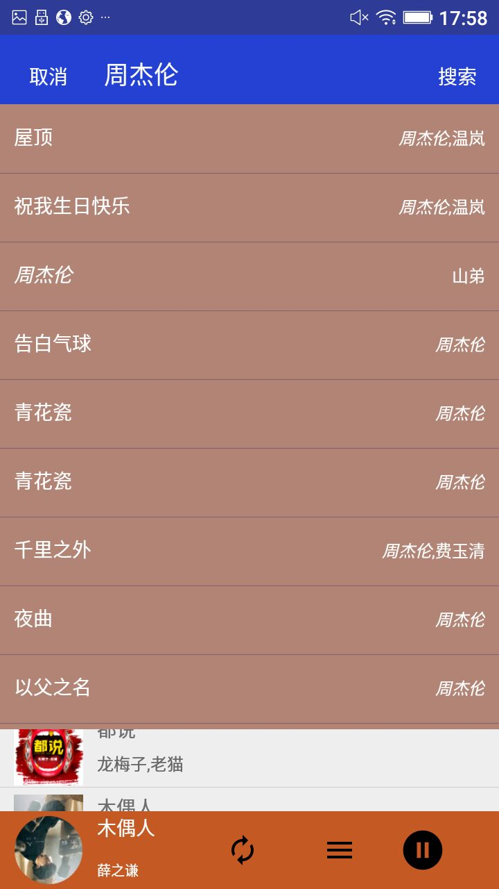

# belongmusic

[![Platform][1]][2]

[1]:https://img.shields.io/badge/platform-Android-blue.svg  
[2]:https://github.com/iMeiji/Toutiao

## Statement
是个人学习自定义View过程中的总结,这是第一个版本，第二个版本丢失了

##Point
- 通过Service+Broadcast+MediaPlayer实现音乐播放
- 实现了循环，单曲，随机三种播放模式

##Statement
- Api来自网路，根笔只是用来学习，不进行任何商业交易

## Screenshots

